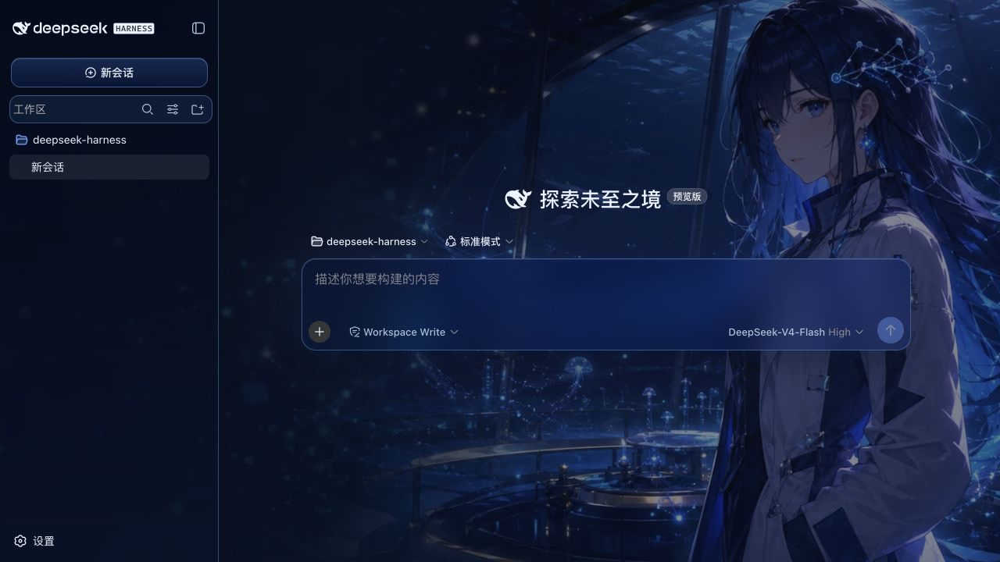
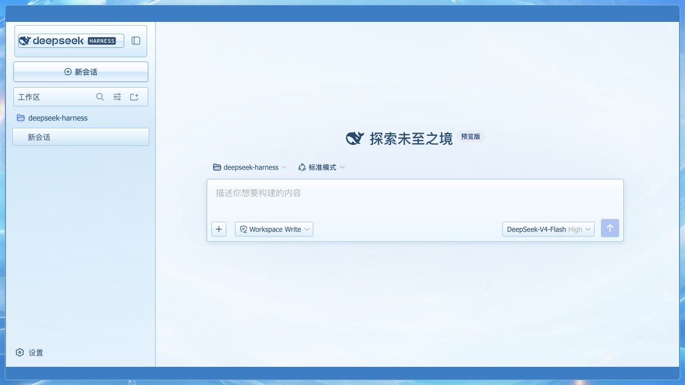
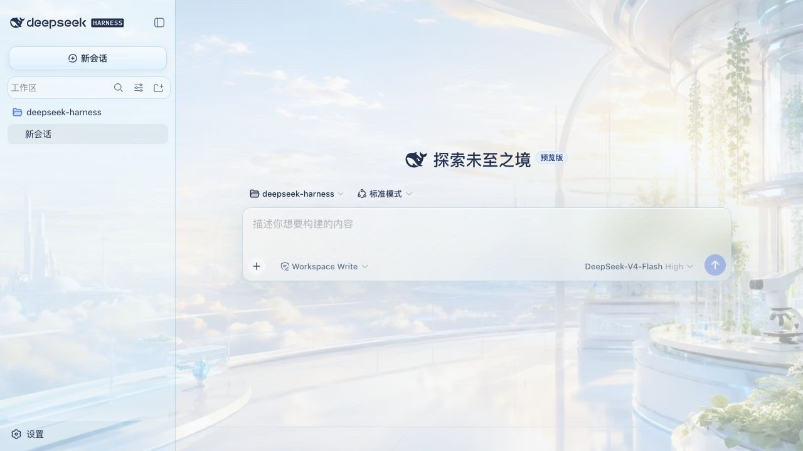
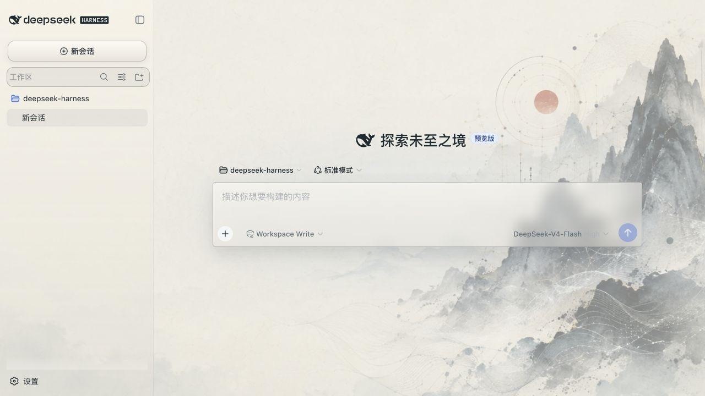
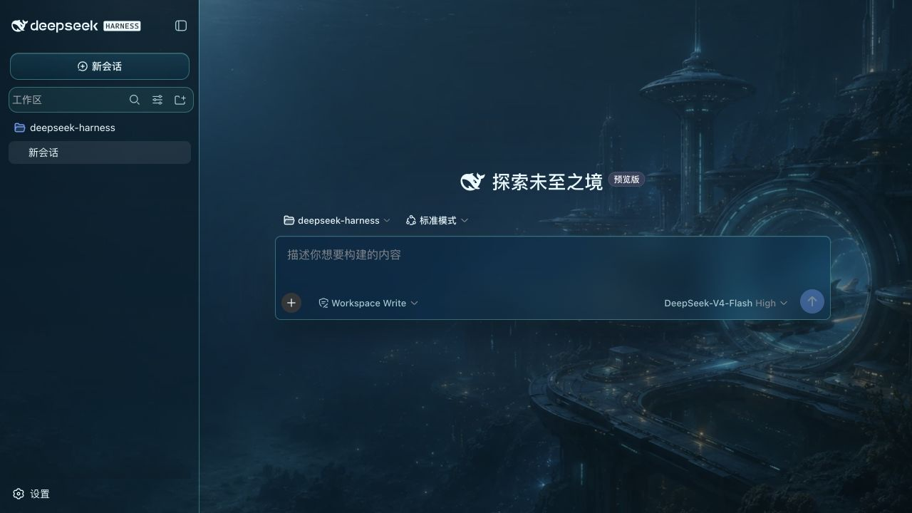
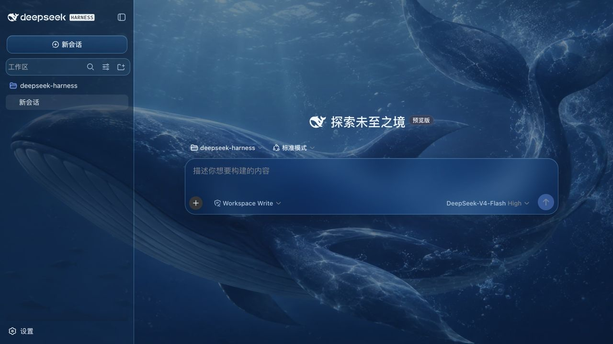
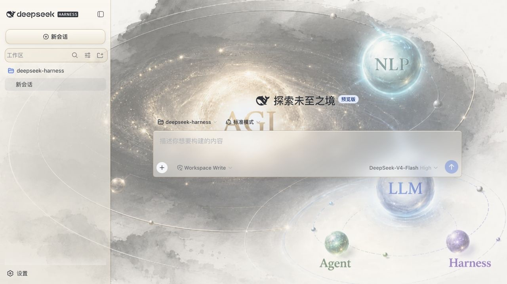
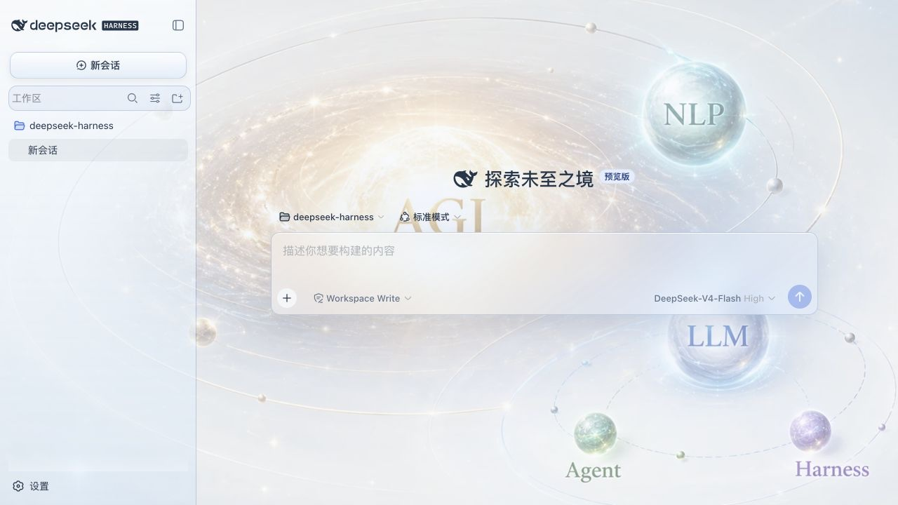

# dsh-skin-appearance

An appearance plugin for [DeepSeek Harness](https://github.com/deepseek-ai/deepseek-harness).

It keeps the Harness UI native and adds an Appearance settings page with:

- eight bundled image themes, each with its own matching sidebar, new-session button, search chrome, and composer surface;
- a local wallpaper picker that downsizes images before storing them;
- automatic palette extraction and matching light/dark appearance for uploaded wallpapers;
- independent wallpaper opacity and blur controls, defaulting to 100% opacity and 0 px blur;
- Host-backed persistence across web restarts; and
- one-click reset to the native Harness appearance.

## Theme gallery

| DeepSeek-chan · Abyss Echo | QQ2008 · Crystal Blue |
| --- | --- |
|  |  |
| Cloud Lab | Ink Algorithm |
|  |  |
| Abyss Starport | Deep-sea Song |
|  |  |
| Intelligence Orbit · Ink | Intelligence Orbit · Dawn |
|  |  |

## Install

The plugin is a dsh bundle. Install it into the web profile with the Harness CLI:

```sh
dsh plugin --profile web add /path/to/dsh-skin-appearance
dsh web
```

The `dsh.bundle.patch` declaration adds the plugin to the profile layer stack. On the next web boot, its browser bundle is discovered through the `dsh.client` declaration and the new Appearance page appears in Settings.

For a published package, replace the local path with the package name:

```sh
dsh plugin --profile web add dsh-skin-appearance
```

## Design

The Node half registers the `appearance` settings namespace using the Harness settings service. The browser half registers palette definitions through `ctx.theme`, contributes a `settings.section` slot, and owns a wallpaper layer covering the whole app root. Each bundled image theme also selects a dedicated surface recipe for the workspace sidebar, new-session action, section chrome, and composer. Custom wallpapers use an automatic light or dark glass recipe. The wallpaper layer itself never uses `backdrop-filter`; blur is limited to bounded interface surfaces so streaming and scrolling remain responsive.

Uploaded images are decoded and compressed to a JPEG data URL with a 1600 px long-side limit before they enter the settings document. A separate 48 px sample produces the dominant accent, a hue-separated secondary color, readable surface/text colors, and a matching light/dark mode. Preset palette tokens are managed by the Harness theme runtime, so switching back to `Default` delegates to the built-in system preference.

## Development

This package follows the standalone client-plugin build shape used by Harness:

```sh
pnpm install
pnpm build
```

To test it against a source checkout of Harness, build Harness first, then install this directory into its web profile:

```sh
cd /path/to/deepseek-harness
pnpm install
pnpm build
dsh plugin --profile web add /path/to/dsh-skin-appearance
dsh web
```

The package deliberately declares Harness services as peer dependencies. This keeps the plugin on the same Cordis, settings, theme, and React instances as the host application instead of bundling duplicate service identities into the browser bundle.

## License

MIT.
